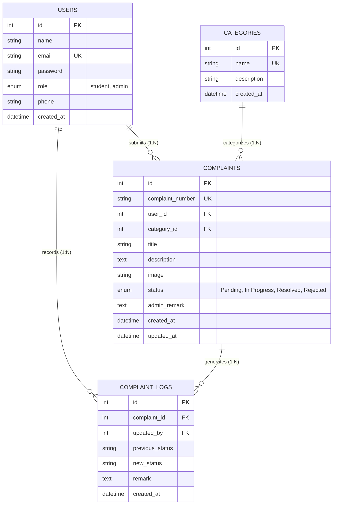

# Tribhuvan University - Faculty of Humanities and Social Sciences
## Bachelor of Computer Applications (BCA) - 4th Semester
### Project I Report: College Complaint Management System (CCMS)

---

## 1. Introduction & Background

In many academic institutions and university colleges, grievance reporting and infrastructure feedback are traditionally conducted through manual channels—such as paper application letters, physical suggestion boxes, or verbal complaints lodged with department staff. 

These legacy methods suffer from critical shortcomings:
- **Lack of Transparency**: Students have no mechanism to track whether their grievance has been received, investigated, or assigned to a technician.
- **Lost Documentation**: Physical complaints often get misplaced or delayed between administrative departments.
- **Absence of Accountability**: Administrators lack centralized dashboards to monitor recurring campus problems (e.g. repeated Wi-Fi outages in specific labs or broken classroom projectors).
- **Communication Gaps**: Students are not notified when issues are resolved or why a particular complaint was rejected.

The **College Complaint Management System (CCMS)** solves these problems by providing a web-based, centralized platform where students can register complaints with optional photographic evidence, track status in real-time, and receive official administration remarks.

---

## 2. Project Objectives

### General Objective
To develop a user-friendly, responsive, and secure web application that streamlines grievance submission, tracking, and resolution between college students and campus administration.

### Specific Objectives
1. To enable students to lodge complaints online categorized by college department (Facilities, Computer Labs, Internet, Library, etc.).
2. To allow students to upload photographic evidence supporting their grievance.
3. To generate unique reference tracking numbers (`CMP-YYYY-XXXX`) for every grievance.
4. To provide an administrative dashboard displaying grievance metrics, status ratios, and category breakdowns using Chart.js.
5. To implement complete CRUD (Create, Read, Update, Delete) functionality for both student grievances and administrative categories.
6. To implement an audit timeline history logging every status transition and administrative remark.
7. To provide a public complaint status tracker on the portal homepage.

---

## 3. Scope and Limitations

### Scope
- Applicable to colleges, university campuses, and academic departments.
- Dual-role support: Students and Administrative Staff.
- Multi-category grievance routing (Labs, Library, Classrooms, Hostel, Wi-Fi, etc.).
- Responsive design compatible with desktops, laptops, tablets, and smartphones.

### Limitations
- Does not integrate external SMS or email gateways (relies on portal-based notifications and status updates).
- Requires an active local network connection or internet to reach the college web server.
- File uploads are restricted to standard image formats (JPG, PNG, WEBP) up to 2 MB to prevent server storage exhaustion.

---

## 4. System Requirements

### Hardware Requirements
- **Server / Development Host**:
  - Processor: Intel Core i3 or equivalent (minimum 2.0 GHz)
  - RAM: 4 GB (8 GB recommended)
  - Storage: 500 MB available disk space for source files and uploads
- **Client Device**:
  - Any standard PC, laptop, or mobile device with a modern web browser.

### Software Requirements
- **Operating System**: Windows 10/11, Linux, or macOS
- **Web Server**: Apache 2.4 (via XAMPP)
- **Database Engine**: MySQL 5.7+ or MariaDB 10.4+
- **Server-side Language**: PHP 8.0+ with `pdo_mysql` and `fileinfo` extensions enabled
- **Client-side Tools**: Modern web browser (Google Chrome, Mozilla Firefox, Microsoft Edge, Brave)

---

## 5. System Architecture & Modules

The system uses a modular **3-Tier Web Architecture**:
1. **Presentation Tier (Client)**: HTML5 semantic tags, custom CSS styling, Bootstrap 5.3 components, and Vanilla JavaScript for client validation and Chart.js dashboards.
2. **Application Tier (Server)**: Native PHP scripts managing session authentication, role authorization, CSRF token validation, input sanitization, and business rules.
3. **Data Tier (Storage)**: MySQL relational database accessed exclusively through PDO prepared statements.

### Core Modules

#### A. Authentication & Authorization Module
- Student self-registration with duplicate email prevention.
- Secure login verifying Bcrypt password hashes (`password_verify()`).
- Session role guard (`requireRole('student')`, `requireRole('admin')`) preventing privilege escalation.
- Clean session destruction upon logout.

#### B. Student Grievance Module
- **Submission (CREATE)**: Select category, enter title, provide detailed description, and optionally attach evidence image.
- **Viewing (READ)**: Filterable list of student's submitted grievances with status badges.
- **Details View**: Shows grievance details, attached photo, admin remarks, and activity timeline.
- **Editing (UPDATE)**: Modifying title, category, description, or photo (allowed only while status is `Pending`).
- **Deletion (DELETE)**: Removing grievances (allowed only while status is `Pending`); removes image from server storage.

#### C. Administrator Grievance Module
- **Triage & Filter**: Filter grievances by status (`Pending`, `In Progress`, `Resolved`, `Rejected`) or category; search by keyword.
- **Status Transition & Remark**: Change status and post official resolution remarks.
- **Timeline Logging**: Automatically records every status change in `complaint_logs` with admin identity and timestamp.
- **Purge Grievance**: Delete invalid or spam complaints with attached evidence cleanup.

#### D. Category Management Module (Full CRUD)
- **CREATE**: Add new departments/categories.
- **READ**: View all categories with count of assigned complaints.
- **UPDATE**: Edit category names and descriptions.
- **DELETE**: Delete categories with foreign key referential integrity protection (`ON DELETE RESTRICT`).

#### E. Analytics & Dashboard Module
- Live count badges for Total, Pending, In Progress, Resolved, and Rejected complaints.
- Chart.js doughnut chart visualizing status proportions.
- Chart.js bar chart displaying complaints per campus department.

---

## 6. Database Design

### Entity-Relationship Diagram (ERD)

### Relational Schema Tables

#### Table 1: `users`
| Field | Type | Null | Key | Description |
|---|---|---|---|---|
| `id` | INT | NO | PRI | Auto-increment primary key |
| `name` | VARCHAR(100) | NO | | User's full name |
| `email` | VARCHAR(100) | NO | UNI | Unique college email |
| `password` | VARCHAR(255) | NO | | Bcrypt password hash |
| `role` | ENUM | NO | | 'student' or 'admin' |
| `phone` | VARCHAR(20) | YES | | Optional contact phone |
| `created_at` | DATETIME | NO | | Account creation timestamp |

#### Table 2: `categories`
| Field | Type | Null | Key | Description |
|---|---|---|---|---|
| `id` | INT | NO | PRI | Auto-increment primary key |
| `name` | VARCHAR(100) | NO | UNI | Unique category name |
| `description` | TEXT | YES | | Category scope description |
| `created_at` | DATETIME | NO | | Registration timestamp |

#### Table 3: `complaints`
| Field | Type | Null | Key | Description |
|---|---|---|---|---|
| `id` | INT | NO | PRI | Auto-increment primary key |
| `complaint_number` | VARCHAR(30) | NO | UNI | Unique reference (CMP-YYYY-XXXX) |
| `user_id` | INT | NO | FK | References `users(id)` ON DELETE CASCADE |
| `category_id` | INT | NO | FK | References `categories(id)` ON DELETE RESTRICT |
| `title` | VARCHAR(200) | NO | | Complaint title/subject |
| `description` | TEXT | NO | | Detailed explanation |
| `image` | VARCHAR(255) | YES | | Relative upload file path |
| `status` | ENUM | NO | | 'Pending', 'In Progress', 'Resolved', 'Rejected' |
| `admin_remark` | TEXT | YES | | Official administration remark |
| `created_at` | DATETIME | NO | | Timestamp when lodged |
| `updated_at` | DATETIME | NO | | Auto-updated timestamp |

#### Table 4: `complaint_logs`
| Field | Type | Null | Key | Description |
|---|---|---|---|---|
| `id` | INT | NO | PRI | Auto-increment primary key |
| `complaint_id` | INT | NO | FK | References `complaints(id)` ON DELETE CASCADE |
| `updated_by` | INT | NO | FK | References `users(id)` ON DELETE CASCADE |
| `previous_status`| VARCHAR(50) | YES | | Status before update |
| `new_status` | VARCHAR(50) | NO | | Status after update |
| `remark` | TEXT | YES | | Transition note or remark |
| `created_at` | DATETIME | NO | | Action timestamp |

---

## 7. CRUD Operations Summary

| Entity | Operation | Responsible Role | Implementation File | SQL Mechanism |
|---|---|---|---|---|
| **Complaint** | **CREATE** | Student | `student/submit_complaint.php` | `INSERT INTO complaints (...) VALUES (...)` |
| **Complaint** | **READ** | Student / Admin | `student/my_complaints.php`, `admin/complaints.php` | `SELECT c.*, cat.name ... FROM complaints ...` |
| **Complaint** | **UPDATE** | Student (Details) | `student/edit_complaint.php` | `UPDATE complaints SET ... WHERE id = ? AND status = 'Pending'` |
| **Complaint** | **UPDATE** | Admin (Status/Remarks)| `admin/view_complaint.php` | `UPDATE complaints SET status = ?, admin_remark = ? ...` |
| **Complaint** | **DELETE** | Student (Pending) | `student/delete_complaint.php` | `DELETE FROM complaints WHERE id = ? AND status = 'Pending'` |
| **Complaint** | **DELETE** | Admin (Purge) | `admin/delete_complaint.php` | `DELETE FROM complaints WHERE id = ?` |
| **Category** | **CREATE** | Admin | `admin/categories.php` | `INSERT INTO categories (name, description) VALUES (?, ?)` |
| **Category** | **READ** | Admin | `admin/categories.php` | `SELECT cat.*, COUNT(c.id) ... FROM categories ...` |
| **Category** | **UPDATE** | Admin | `admin/categories.php` | `UPDATE categories SET name = ?, description = ? WHERE id = ?` |
| **Category** | **DELETE** | Admin | `admin/categories.php` | `DELETE FROM categories WHERE id = ?` (guarded) |

---

## 8. Security Measures Implemented

1. **SQL Injection**: Complete eradication by using **PDO Prepared Statements** with parameterized inputs across all database interactions.
2. **Cross-Site Scripting (XSS)**: All dynamically outputted strings are sanitized using `htmlspecialchars()` via helper `e()`.
3. **Password Security**: Passwords stored as one-way cryptographic hashes using PHP's native `password_hash($pass, PASSWORD_BCRYPT)`.
4. **Cross-Site Request Forgery (CSRF)**: Random cryptographic tokens (`bin2hex(random_bytes(32))`) validated via `hash_equals()` on state-changing forms.
5. **Secure File Uploads**:
   - Client extension whitelist: `.jpg`, `.jpeg`, `.png`, `.webp`.
   - File size ceiling: 2 MB maximum.
   - Server-side MIME verification using PHP `finfo` extension (`FILEINFO_MIME_TYPE`).
   - Dedicated `uploads/.htaccess` file that denies execution of `.php` or script files.
6. **Authorization Guarding**: Every student and admin script executes `requireRole('student')` or `requireRole('admin')` before rendering output.

---

## 9. Conclusion & Future Enhancements

The College Complaint Management System fulfills all requirements of the TU BCA 4th Semester Project I syllabus. It presents a clean, robust, and understandable software architecture that bridges the communication gap between students and campus authorities.

### Future Enhancements
1. **Email & SMS Notifications**: Integration with SMTP or SMS API to notify students when status changes.
2. **Student Feedback & Rating**: Allowing students to rate the resolution quality (1 to 5 stars) once a complaint is marked as 'Resolved'.
3. **Staff Department Routing**: Allowing department heads (e.g. Lab Technician, Electrician, Librarian) to have designated staff roles.
